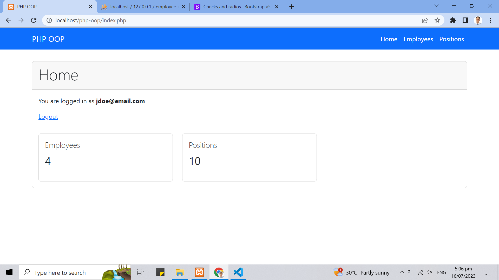

# PHP OOP
- This is a simple project that enables you to perform basic CRUD operations
- This project has login, register, and logout
- This project uses Object Oriented Programming to connect to the database and perform queries
- This project also uses Prepared Statement to prevent SQL Injection

## Preview

